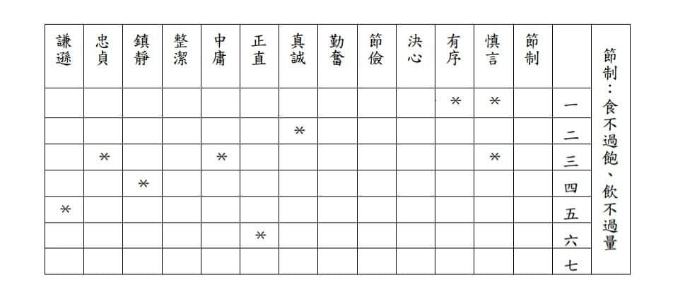

班傑明‧富蘭克林 著\
李夢圓 譯

班傑明‧富蘭克林被譽為「美國第一個偉人」。

富蘭克林出身平凡之家，家裡窮得繳不起學費，儘管如此貧寒，但他卻不以為意，透過持之以恆的自我奮鬥，最終取得了舉世矚目的成就。這種從貧窮到富裕、從卑微到偉大的自我實現歷程，充份體現了人們對「美國夢」的追尋；可以說，富蘭克林是實現「美國夢」最具代表性的人物之一。

富蘭克林的偉大或許無法複製，但他奮發向上繼而走向成功的心路歷程，讀者卻可加以學習。正如他的朋友在寫信給他時提到，他的自傳「將為自我激勵提供崇高的法則和典範」，使年輕人「早日意識到潛心事業、節儉生活以及自我克制的重要性」。

《富蘭克林自傳》不但具有崇高的文學價值，更開創現代西方自傳文學先河，成為傳記文學的典範。本書以平易近人的文風，敘述了富蘭克林艱苦創業、自學成才、堅持不懈的奮鬥過程，這一過程具備了偉大的感召力，使本書出版後就立即暢銷，並被尊為成功勵志的傳世經典，得到眾多成功學大師的一致推薦，被推崇為史上最動人和偉大的勵志讀本。閱讀此書，能激勵讀者不斷改進自己、完善自己。\
                                                  ____________________________

這本書當中我對於「克己修德計畫」之13項美德最有興趣，覺得是個值得跟大家分享之做人準則，雖然我們當不成偉人，卻可以將這些美德當作自己的生活準則，藉此更靠近偉人。

這些美德就富蘭克林來看，是有先後順序的，我覺得第一項是件很妙的事情，剛好也是我近來的生活準則，現在就開始囉!!

📌節制：食不過飽，飲不過量。\
📌慎言：不說對人對己無益的話，不參與閒談。\
📌有序：一切物品都應規律有序，每件事都應該安排時間完成。\
📌決心：下決心去完成的事，下決心之後一定要完成。\
📌節儉：所花錢財必須於人或於己有利，不浪費一分一毫。\
📌勤奮：不浪費時間，每一分鐘都做有用的事，摒棄一切不重要的行為\
📌誠實：不欺騙、傷害他人，思想要純潔公正，說話要實事求是。\
📌正直：不冤枉傷害他人，不忽略自己能造福他人的責任。\
📌中庸：避免趨於極端。受到應得懲罰，不要感到羞怒。\
📌整潔：保持身體、衣服、工作和住所始終整齊乾淨。\
📌鎮靜：不受瑣事、普通或難以避免的事故紛擾。\
📌忠貞：不亂搞男女關係，以免使大腦混沌、使身體虛弱或破壞自己亦或他人的安寧或名聲。\
📌謙卑：效仿基督或蘇格拉底。

富蘭克林希望擁有上述所有美德，並能養成相應的習慣，也很清楚注意力是有限的，最好不要試圖畢其功於一役；應該循序漸進，每次以培養一種美德為目標，待完成之後再繼續前進，直到擁有這13項美德。

「節制」是首要的，因為它能使頭腦冷靜清晰，以防止舊習慣的不斷引誘。在養成「節制」這項美德後，「沈默」就容易些了。因為在培養品德的同時，也希望獲得知識，而談話時知識的獲得需要側耳傾聽，並非動嘴皮子。

再來就是養成「有序」的美德後，就是下定決心於他自己的計畫和學習。等堅定的意志成為習慣後，能讓富蘭克林在培養後續美德的努力中堅定不動搖。

最有趣的是富蘭克林製作了一本小冊子，方便每日自省，這個設計是這樣的，上頭排列了十三種美德，在右側標表頭列上本週執行重點，在那一週他將全力避免犯下那一重點美德，而其他的暫時不管，只是在每日自省中做紀錄，這樣他可以將注意力一次專注在一項美德之上，如此依序進行，從而在十三週之內完成全部過程，每年反覆四次。

富蘭克林就是將一個大目標，拆解成數個小目標，藉由這本小冊子，可以看到自己在德行方面的進步，獲得快樂。

所有好習慣的建立不也如此?慢慢慢慢地用複利概念累積，根基打得穩，後面想要衍生出來的好習慣，都是可預見的。只是這個表格好具體，可以日日檢視自己，是不是正朝向自己訂定的方向前進，有空大家不妨可以試試這個方法，就此方法成為更好的自己。

