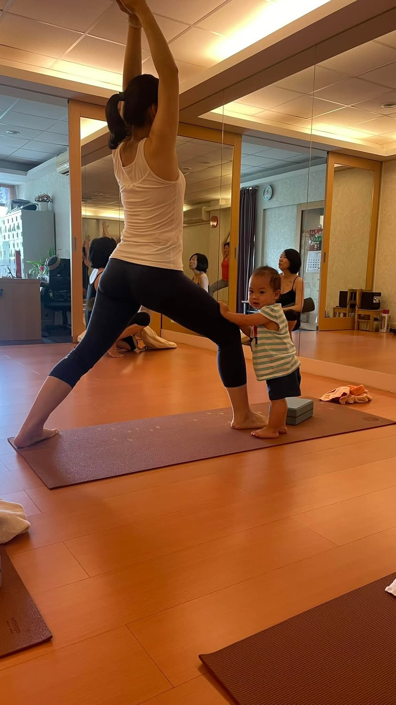

我覺得現在有很多的媽媽都好厲害，雖然要帶孩子，但如果有心要做任何事，都會想辦法克服，做自己想做的事情。

為何突然有這種想法？源自於今天中午上瑜珈的時候，看到一個媽媽帶著3個孩子來上課，其中一個孩子還是她朋友的，真的有夠猛的。她到了教室後，讓3個孩子在教室外面玩，自己則盡情享受瑜珈帶來的哀嚎😂

其中有個孩子是娃兒，小小的身軀在教室走來走去的好可愛，進來教室後到處喊媽媽，逗樂教室裡的同學了。這個娃兒半年前還只會在教室裡爬來爬去的，現在居然會走了，真的是陪媽媽練瑜珈一起長大的娃兒耶！

最後要下課的時候，看到娃兒站在媽媽旁時，忍不住照了下來，真是一對幸福的母女🥰

