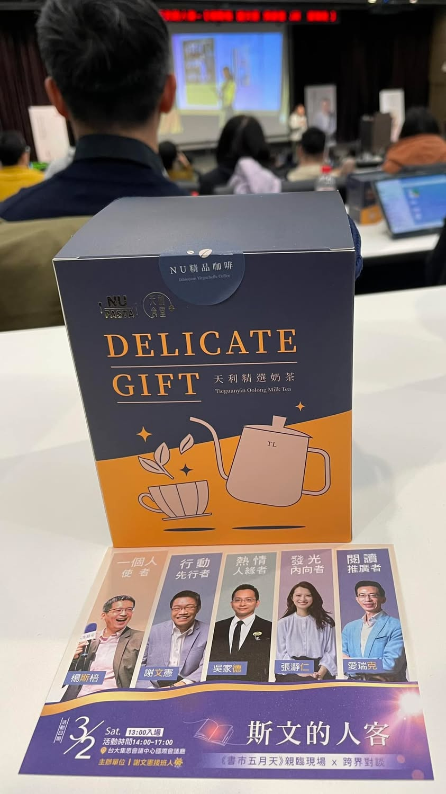
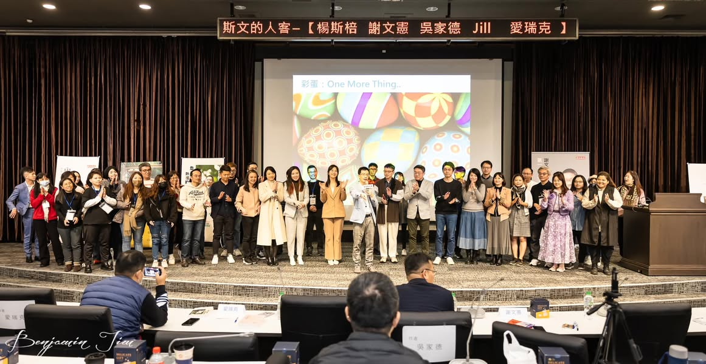

昨天參加完書市五月天演唱會後，先說隊友的唯一感想，就是他非常認同 謝文憲 憲哥說的一句話，那就是「讀完一本書後，如果你可以用3分鐘跟隔壁的人說這本書在講什麼的話，那表示你已經讀懂這本書了」。然後他就轉過來跟我說「你每次跟我說一本書都要說20到30分鐘，這太久了，請改進!」這……，實在是太難啦!只給我3分鐘，那我只能學 愛瑞克 回答說「我一向不超時(但不保證這次會不會有例外)」，然後再不疾不徐地說完。只是我到底聽到了什麼奇怪的感想啦!!好想叫隊友退我1000元，可惡!!

再來就是我的感想了\
昨天出門沒看 #創意閒聊好朋友 的訊息，錯過與大家認識有點可惜。\
一到會場，就有讓我回到幾年前參加五月天演場會的興奮感，哇哇哇~~好多人啊!!我看到5位作家在現場，整個熱血沸騰起來了，好想把螢光棒拿出來尖叫喔!!憲哥一出場，會場整個都嗨起來了，這真的是讀書會嗎?我好喜歡這種氣氛，真的要親臨現場才知道那樣的感覺，不過這也是憲哥個人獨特主持風格所致啦!!

5個作家要講述的是彼此的書，會場中我看到的是5個作家講述的是彼此，不論是品行、所寫的書、理念及日常生活的一切，要說是讀書，我覺得更是讀一個人，彷彿他們講述的就是在座所有與會人的朋友(我想大家應該都看過這5本書，除了我隊友啦!他只有聽我說)，讓我們更貼近作者。

\#要有一個人 斯\
楊斯棓醫師的書，用他推動社會閱讀運動的精神，來讓大家認識22位對台灣有不同領域貢獻的人物，當然也包括他這位實踐主義的社會運動者。\
昨天在會場得知楊醫師每年大概用100萬的費用買書，讓愛書人得以閱讀。可以跟 #誠品文化藝術基金會 聯繫，進行捐書計畫。

\#極限賽局  文\
謝文憲  憲哥的書，人生就像球賽，單局驚悚劇、九局是喜劇，只有在輸球的時候，人生價值才會出現。人生就是一場敗部復活戰，活著就能照亮別人。

\#生活是一場熱情的遊戲 的\
吳家德  老師的書，由一位島內過動兒來告訴你，如何對人感興趣，讓生活變有趣，他是一位連早上跑步都要關心羊咩咩的生活熱情家，真的是很佩服他的精力，因為他的書，讓我也想要藉由聊天來認識人了。

\#不假裝也能閃閃發光  人\
張瀞仁 Jill Chang   告訴我們要如何克服冒牌者症候群，要如何發現自己身上的光，原來也可以帶給自己跟別人幸福。就像憲哥說的，活著就能照亮別人。

憲哥昨天問jIll一個問題，如果可以選擇讓你變成憲哥，你願不願意?\
Jill 想了一下，搖搖頭害羞的說，憲哥雖然是我的偶像，變成憲哥也很好，但是我發現我也有自己小小的優點(此時臉紅不已)，可以好好照顧我身邊的人，如果張瀞仁不見了，他們怎麼辦?\
聽了真的覺得好張瀞仁的答法，然後我很喜歡她的回答，因為我也會這樣選擇。

\#內在成就 客\
愛瑞克愛閱讀  愛瑞克告訴我們「有」是給別人看的，「無」是我們自己知道的，如內探求第二座山，如實觀察，進化自己也能淨化身心。

昨天愛大高敏性人格展現讓我覺得好可愛，整個大圈粉啦!!從演講與觀眾不是四目相接，原來是看麥克風頭、和Jill玩高敏內向者優點的接力賽及最後幫 陳怡嘉老師抽衛生紙的靦腆樣，都覺得愛大是個細心、貼心的大男孩。

感恩昨天隊友在感冒之際還是開車載我們一起前往參加(而且吃藥後還沒打瞌睡)、謝謝憲哥辦了一場精采的讀友會，也謝謝當初的自己替自己報名了這場演唱會，的確是值回票價~~

