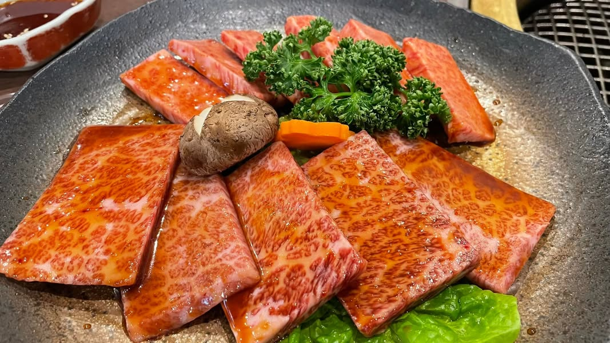
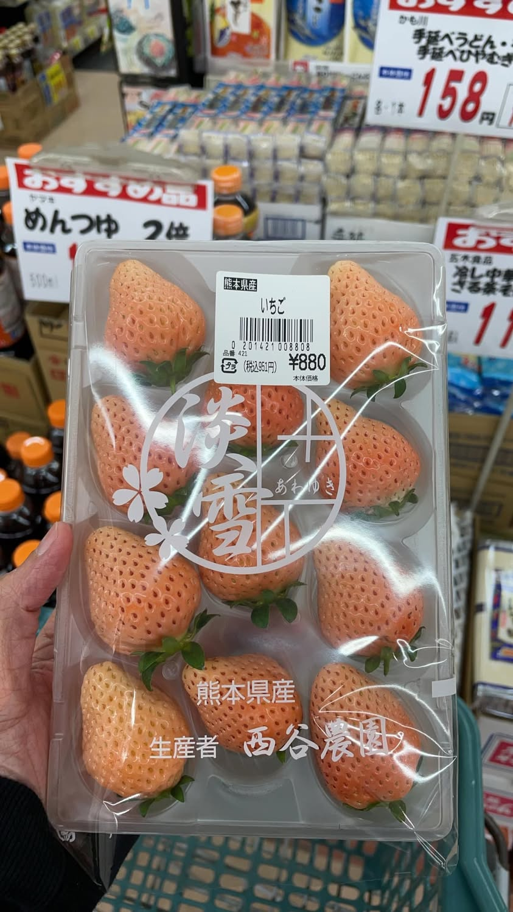

一家人期待已久的旅行總算來了。

今晚入住的飯店 #岡山プラザホテル 就在旭川櫻花道旁邊，原本以為會有滿滿的櫻花歡迎我們，結果只有枯木含著花苞😳

我立刻說：至少天氣非常棒，暖呼呼的很舒服，最重要的就是心境，帶點遺憾，下次才可以再來賞櫻啊🌸

公公也接著說：出來玩最重要的就是愉快的心情，只要一起出來玩，都很好。

隊友說：只能這樣了！期待明天比較南邊的廣島會有一咪咪的櫻花可以看！

我們就這樣你一言我一語的，說完一行四人就開開心心的去吃晚餐了。

今晚吃的是燒肉，這次點的都是和牛部位，婆婆開心極了，直說好好吃，第一次吃和牛燒肉，看她意猶未盡，我就提議再加點，她立刻捨不得的搖搖頭。

「妳不記得妳一直遺憾多年前妳們跟妳朋友去屏東吃黑鮪魚，那時候你們一群人捨不得點，一人只吃到一塊，以為還會再去，結果再也沒有去過了，早知道就多點一份或二份這件事情嗎？我們現在來一次少一次，誰也不知道下次會不會吃到了，這次我們就霸氣的點，吃到膩了再離開。」

「對啊！到現在我還是覺得好可惜，那⋯就再點下去～」

最後真的是吃到大家都膩了才離開，原本打算吃飽後沿著櫻花道散步回飯店，但是打開餐廳門看著漆黑的旭川櫻花道，只好改用逛超市來彌補一下婆婆了。

🍄每日感恩

公公婆婆是旅遊好咖，配合度超高的。

