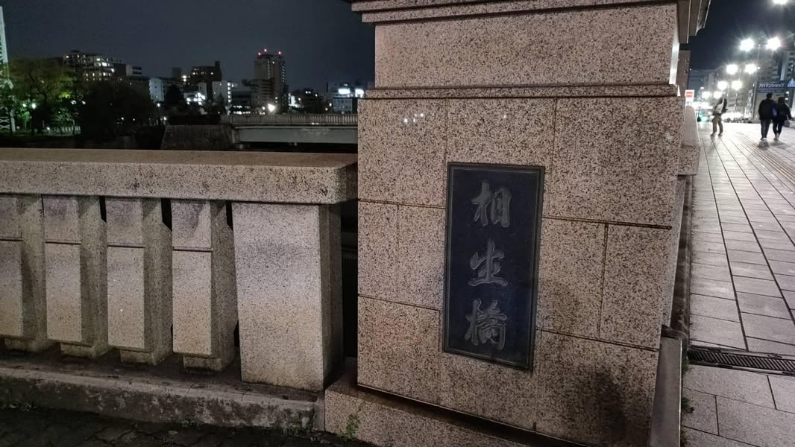
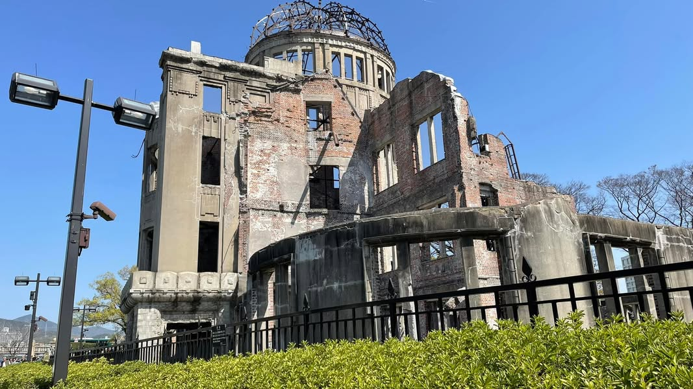
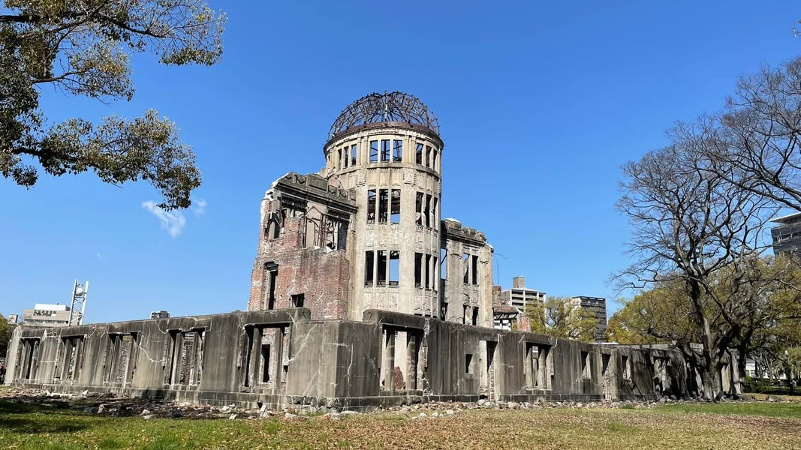
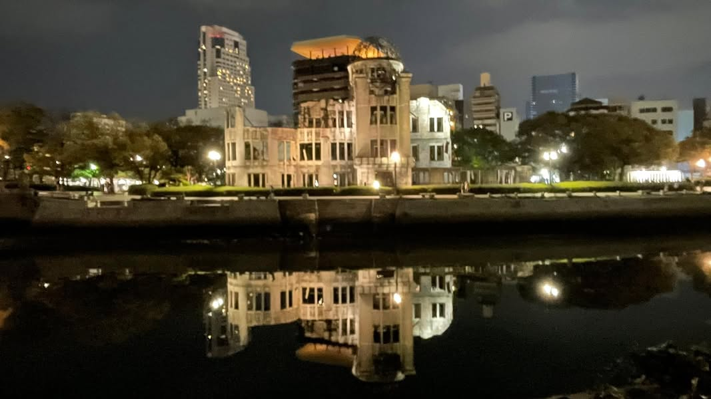

記得先前 #我被貴到了 3盒牛奶糖故事嗎？前天傍晚總算抵達廣島了，廣島入住的房間就在 #廣島平和記念公園 旁，從房間俯瞰下去，公園景色一覽無遺，原爆圓頂也就在附近了。

一到房間，隊友對於窗景非常滿意，過不久就說要給我個驚喜，然後從包包裡拿出2盒牛奶糖，我一看到滿天烏鴉飛過，冷不防的說「別人至少3盒，為何我是2盒？」

「嘿嘿嘿～我想過了，我要殺價，3盒變成2盒，而且我還要回收給我媽媽帶在身上，讓她如果血糖低了可以立刻吃一顆，很棒吧？！」

這個人是不是有病啊？看到隊友拿出牛奶糖出來，霎那間覺得這個人好浪漫喔！結果淨說些543⋯⋯。

---

晚上我們散步到 #相生橋 時，隊友戲劇魂又上身了，學著 #鈴 對 #周作 說的對我說「謝謝你在世界的角落找到我。」

我連忙說「抱歉！抱歉！我找錯人了，你可以退貨或是我退貨，都沒關係！謝謝再聯絡⋯⋯。」

隊友聽完立刻哈哈大笑～

這就是 我倆現實版的 #謝謝你在世界的角落找到我 ，整個就是搞笑版。

很喜歡廣島平和記念公園附近的感覺，淡淡雅雅的，讓人覺得很舒服。本以為日本可以去的地方那麼多，近年內應該不會再去了，沒想到喜歡的程度，居然可以在我們心目中勝出日本其他地方，也太神奇了。

🍄每日感恩

謝謝在原爆圓頂旅遊當天，有個小天使出現主動要幫我們全家合照，這也太幸運了。

