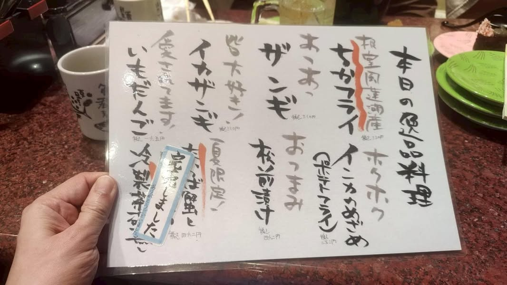
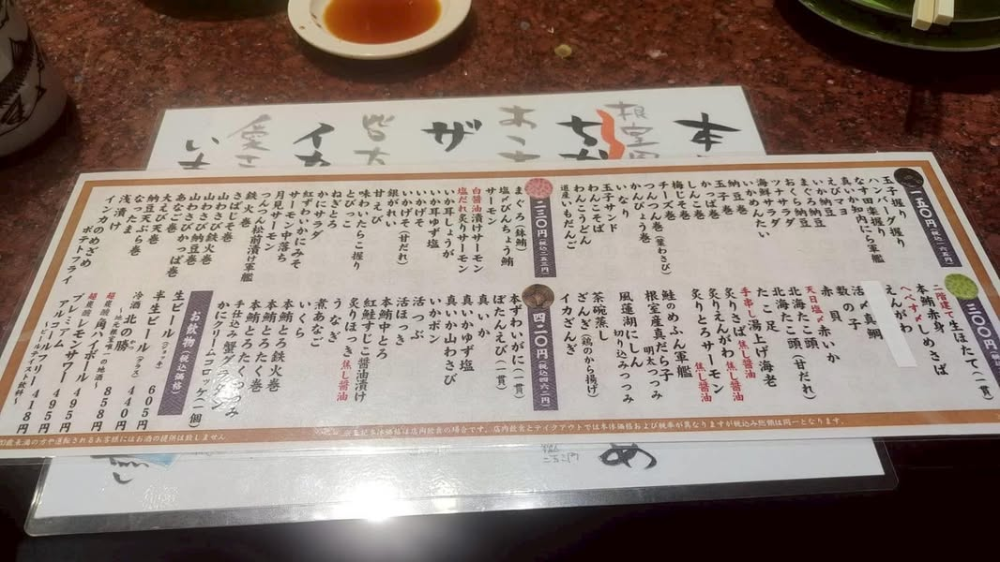
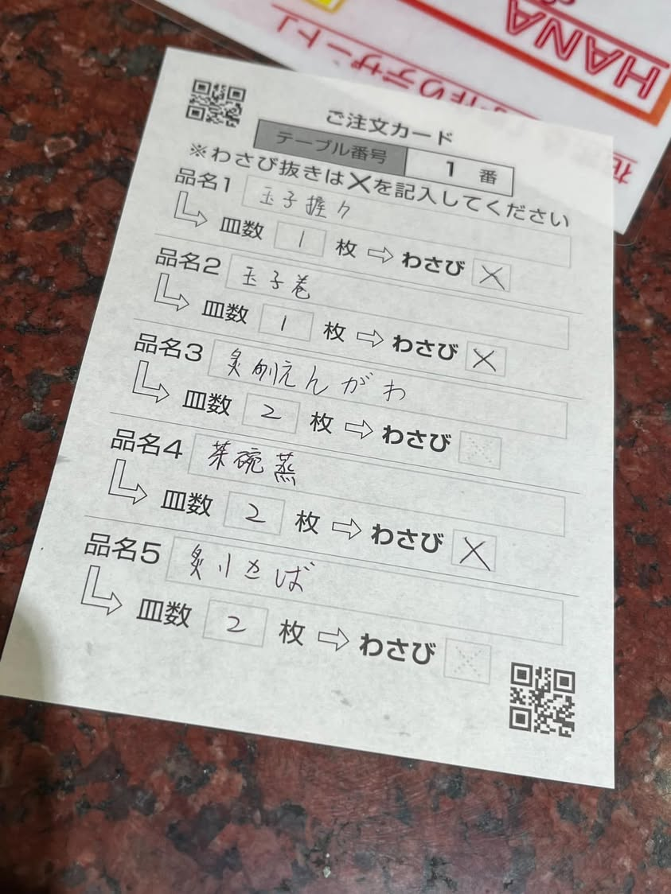

帶外甥女們去日本一直是我的夢想之一，因為我實在不解，為何年輕人對出國沒興趣。所以每年都會問外甥女們要不要出國，雖然她們總是說「沒興趣！不要！」，我還是想要帶她們出國看看，去年總算她們說好，害我嚇好大一跳😂

「阿姨！我可不可以關飛機窗戶的窗簾？」「阿姨！為何退稅商品要用袋子封起來？」「阿姨！我會結帳了。」看到孩子們對於世界這麼好奇，而且敢做平常不敢做的事，心裡其實比他們還興奮跟開心，這個世界總算引起她們一點點的興趣了。

阿姨私心希望這次的旅行不只是旅行，而是希望幫忙他們打開世界旅行的門，其實這個世界很親切，就算語言不通，還是到處都可以走走看看的。趁年輕多走走看看，就算只是吃吃喝喝，也是件美好的事情。

這次旅行當中，讓我印象最深刻的是去函館根室花丸，餐廳裡都是日文菜單，點餐只能手寫在注文單，姊妹倆立刻說，「趕快看群組，阿姨先前有把日翻中菜單放在上面，我們看我們點好的部分，再劃上去注文單就好了。」兩姊妹嘰嘰喳喳的完成這次任務，看起來很有那麼一回事呢！

經過這次旅遊，姊妹們似乎對於將來自己出遊很有興趣，真好！可以看到她們閃閃發光的眼睛。

