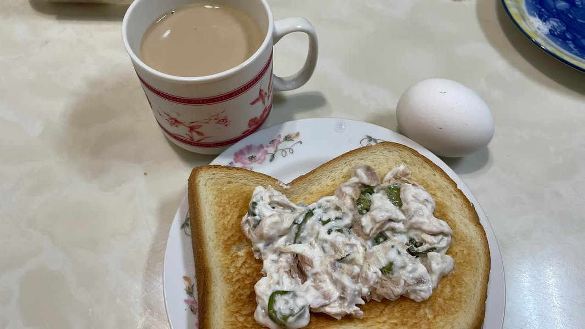
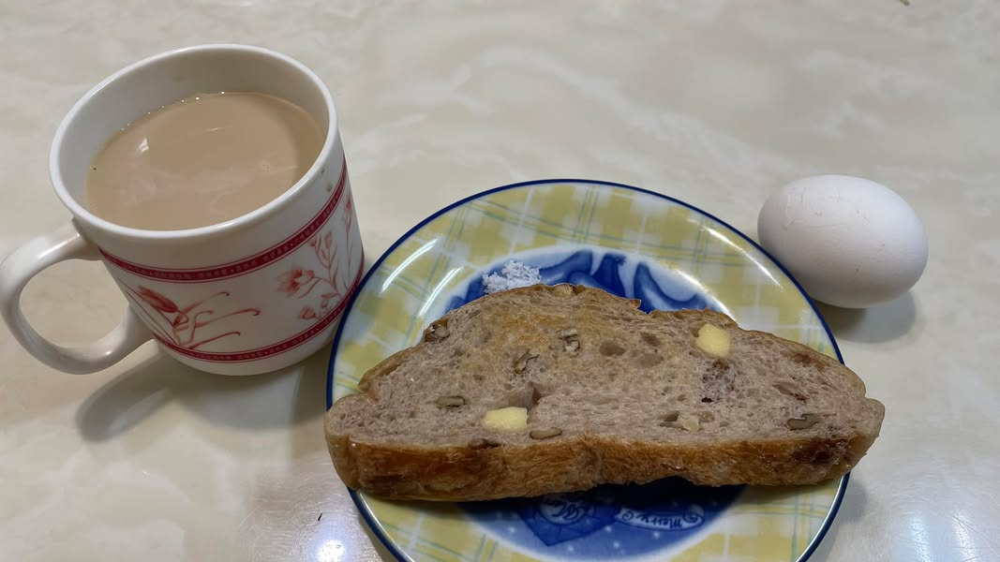

最近手臂裝了一個連續14天連續血糖監控器，它是透過皮下注入一個極細的軟針，軟針前端有一個葡萄糖感應器，每隔5-15分鐘測量皮下組織液裡的葡萄糖再轉換成血糖值，將許多的點(血糖值)串連成線圖，而形成24小時的線圖。

先不要誤會，我的血糖很正常，只是我一直對於食物如何讓身體血糖變化很感興趣，所以就開始進行這件事情。到今天為止已經第9天了，我每天都會盡量試看看不一樣的東西，來看看血糖的變化，其中水果、澱粉類最為恐怖，還好這次測試還搭配營養師2週陪伴，隨時都可以發問，也增長一些知識。

📌吃飯的順序：蛋白質、蔬菜、白飯。

📌水果可以搭配優格，降低血糖波動。

📌同樣的食物，在不同時間吃，血糖波動是不一樣的。

📌麵食類血糖的確是不低。

最後最後，我最驚訝的是零食類-原味波卡、五香乖乖，明明是鹹食，居然是這9天以來血糖飆到最高的食物，這真的是刷新我的三觀。

經過這次實驗後，我對於自己到底吃下什麼更有意識了，一直以來，我都認為知識可以產生力量，唯有擁有正確的知識後，才有機會重新建立好習慣。所以現在又是重新建立飲食習慣的好機會，一旦上軌道後，就可以讓時間站在你這邊，產生好的複利效果。

