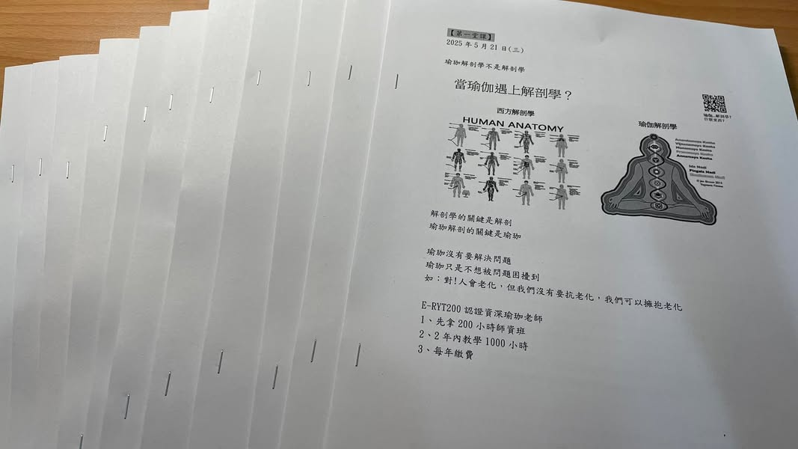

繼2019年上了信宏老師的瑜珈解剖學入門後，沒想到6年後又重新來上一樣的課了，這真的是一件很神奇的事情，同樣的課居然時隔6年又繞回原處。

想想當時的自己真的很熱血，才剛接觸瑜珈1、2年，僅憑藉著對瑜珈的熱愛，居然衝去上課，而且還是週末密集班，真的是勇氣可嘉耶！自己果然沒讓自己失望，當時功力太淺了，雖然每堂課都出席，也很認真，但真的是鴨子聽雷 ，聽不太懂。

雖然聽不懂，但是我很清楚知道一件事情，那就是老師教的好，我也喜歡老師上課的風格，我想應該只是緣份還沒到，所以當時的我倒也沒感到氣餒，想說來都來了，就好好的享受老師的教學，如果未來有機會，再來一次就好了。

今年似乎感覺機緣到了，我決定再度重新出發，勇敢的報名上課，而且我想一週只上三小時，看錄影回播課，應該有機會好好做筆記跟吸收吧！

喔喔喔～我真的小看這三小時的課了，老師給的東西還是跟當年一樣多，我光每週上課跟做筆記，大概就要花費12小時了，這⋯⋯還沒包括複習跟看書耶！

然後，我突然也發現自己的理解能力似乎進步了，雖然還是常常會遇到卡關的時候，但是反覆多聽個幾次，理解似乎會再突破一些些，這時候又有打怪過關的快感了。

也許因為這次我非常想跟上每週的進度，所以每週的學習是辛苦的，常常會焦慮沒時間上課跟做筆記；雖然如此，卻也帶來許多快樂，幾乎每堂課我都會有「啊～原來是這樣喔！喔～原來還可以這樣」的讚嘆。可能是本來就沒有什麼概念，也可能是享受在學習的當下，讓我非常期待每週的上課，很想知道這週老師又會帶給我們什麼樣的驚喜。

不要懼怕學習，如果你確定在正確的路上，就勇敢的繼續往前走，時間到了自然就會看到累積，就算重新學習第2次，彷彿還是像第1次學習一樣的期待跟雀躍。

