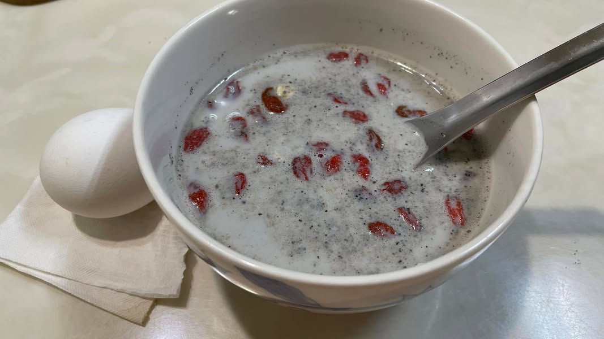
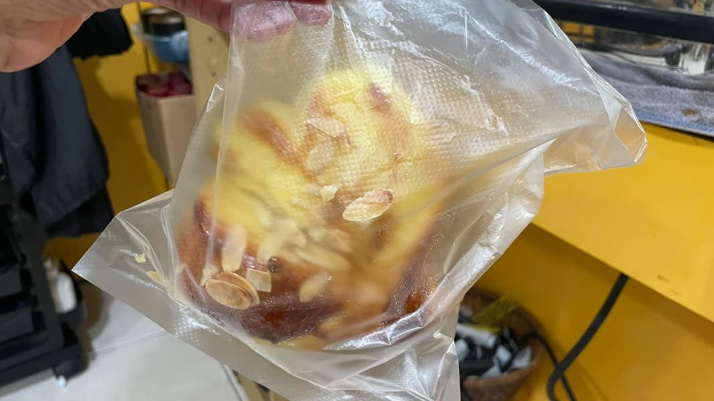

週末放假，決定幫史朗先生、婆婆實測他們每日早餐升糖指數如何？婆婆跟史郎先生一直對於燕麥片黑芝麻早餐跟洋蔥蛋炒飯很有信心，想說利用我的連續血糖偵測機來試看看他們的早餐升糖指數如何？所以當我吃完早餐，就接收到很多關愛眼神，他們好像在等放榜一樣，好可愛喔！所幸結果都不會太差～

還有我利用這次機會，也趁機試看看平常愛吃的垃圾食物有多垃圾，本週上場的是椰子麵包，那天實測的時候剛好在美髮店，我的設計師也很愛這款麵包，所以也跟著我等血糖實測結果，沒想到這次吃完1.5小時居然還沒什麼升糖，真是讓我們又驚又喜，設計師也開開心心的吃完麵包，結果過不久居然飆升到180，我們兩個人差點暈倒，居然被血糖測試機騙了😂

然後設計師就說「又少了一樣可以吃的東西，看怎麼辦啦！」我倒是很樂觀的回應「不會啊！我又揪出一個妨礙我健康的食物了，真是開心，至少我可以清楚知道我吃進去的東西到底多糟也很好啊！」

測測垃圾食物到底多垃圾，我倒是覺得不需要那麼悲觀，畢竟主控權在自己手上，知道真的非常垃圾後，你可以決定不吃，或變成一個月或二個月吃一次，將吃的間隔拉長而已，其實也不會怎樣，至少可以明明白白的知道自己對身體做了什麼事情，不要糊裡糊塗的把身體弄壞，不是也挺好的嗎？

總算快結束這兩週的體驗了，史郎先生說知道他喜歡的食物居然是垃圾前幾名後，這兩週讓他胃口變得很差，然後跟著我吃低GI食物，吃飽之際居然也瘦了啦！他覺得很神奇。搞到現在兩個人的血糖知識大躍進，也是很棒的兩週啦！哈哈哈😂

