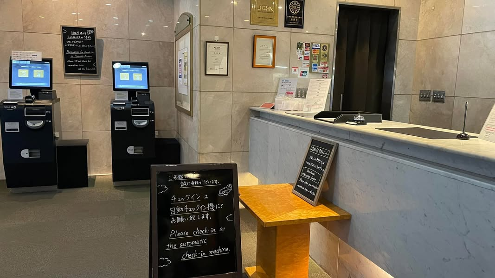

這次旅程有4趟飛機行程，分別是松山機場-羽田機場、羽田機場-新千歲機場，都各2次。

去、回都分別停留在東京ㄧ晚，這樣就不用趕著轉機，可以讓這趟旅程更加悠閒。想想換做從前的我，一定就是當天衝來衝去，一次搞定，這應該也是心境上的進步（但也或許是年紀大了😂）

但人算不如天算，迷糊的我還是在第一天發生了幾件烏龍的事情：\
首先，是下飛機後，要用護照跟VISIT JAPAN WEB產出的QR報到，當時我們看到人很少就很開心的去排隊，不料掃完QR了以後，手機畫面得到一個大❌「資料填寫錯誤」（史郎先生填寫錯誤，我抄答案填寫，一併跟著錯誤），我們居然把回國時間填成抵達時間，為了修改資料，硬是等到另一班飛機也抵達，結果瞬間人爆炸多，等了半小時才出關。

再來就是史郎先生初體驗，他打算用公共電話打給飯店，我們反覆練習日文流暢度，還有模擬飯店可能會問什麼，準備好之後，我就開始錄影（還小心翼翼不要錄到小抄😅），居然成功預約到時間、地點，我們超級開心的，事後檢查錄影檔，我發現原本播放的YouTube沒關，居然錄到YouTuber訪談，史郎先生聲音完全被蓋過去，就這樣⋯，初對話紀錄就這樣飛了。😭

最後就是睡前要拔硬式硬式隱形眼鏡時，發現我忘記帶吸棒，我快慌張死了，我笨拙的用手拉眼皮，看著隱形眼鏡在眼睛裡跑來跑去，又痛又癢的，30分鐘後，眼鏡總算從紅通通的眼睛裡登出，我也快累攤了。

累攤之餘，就開始忍著眼睛的痛癢跟同行的友人求救，請她今天要來日本的朋友，從幫忙買吸棒，但是當時時間已經是台灣的晚上11點，眼鏡行都休息了，我只能放棄，開始查新千歲機場有沒有機會買到吸棒的資訊⋯⋯，就在此時，史郎先生悠悠醒來，問我在忙什麼，我就哭喪著臉跟他説這件事情，他就說「妳應該早點跟我說這件事情啊！」我：「剛剛忙著拔隱形眼鏡，想說把你叫醒，你只會擔心，我要忙著擔心自己、還要安撫你的擔心，倒不如我一個人擔心啊！」這時候他就說「我是不是說過老公是萬能的😎」我：「咦！你有解決方法？」我說完之後他就從包包拿出一根吸棒。我瞪大眼不可置信說「你怎麼有？」只見他得意洋洋說「多年前妳也有一次忘記帶，回家之後我就叫妳給我一根吸棒帶著備用，只是時間久到我也忘記到底還有沒有留著，沒想到居然找到了。」當下我真的很開心，喊著「謝謝老公，老公最好了，我最愛老公了。」🤭

生活中有個情緒穩定的另一半真的很重要，可以把每件看起來是不好的事情，都化成一件好笑、好玩的體驗（可能也只有我這樣覺得啦！）只是可憐我的眼睛白白受苦30分鐘，看來未來的日子還是要靠萬能老公的照顧了。

