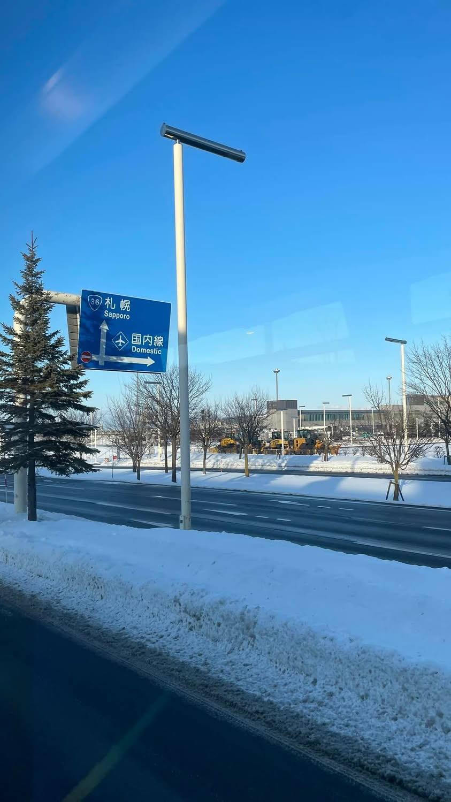

以前前往雪場的交通工具，史郎先生往往都只願意搭雪場巴士，因為這樣可以下飛機後不用移動太久、太遠，立刻就可以趕往下班交通工具，簡單暴力又比較輕鬆。

從前的我總覺得好可惜，覺得應該帥氣的背著雪板，再稍作停留去看看城市的風景，再搭個新幹線前往、轉車，好像才是時尚的滑雪人。

8個年頭過去了，繞來繞去、走走停停，開車、搭新幹線，什麼方法都用遍了，我才明瞭原來簡單才是最適合自己的方法，有過一圈才知道自己最適合什麼，也甘於簡單、平淡。

現在坐在雪場巴士上，看著藍天、白雲，覺得可以安心放空、休息3個小時，也是一種幸福。

