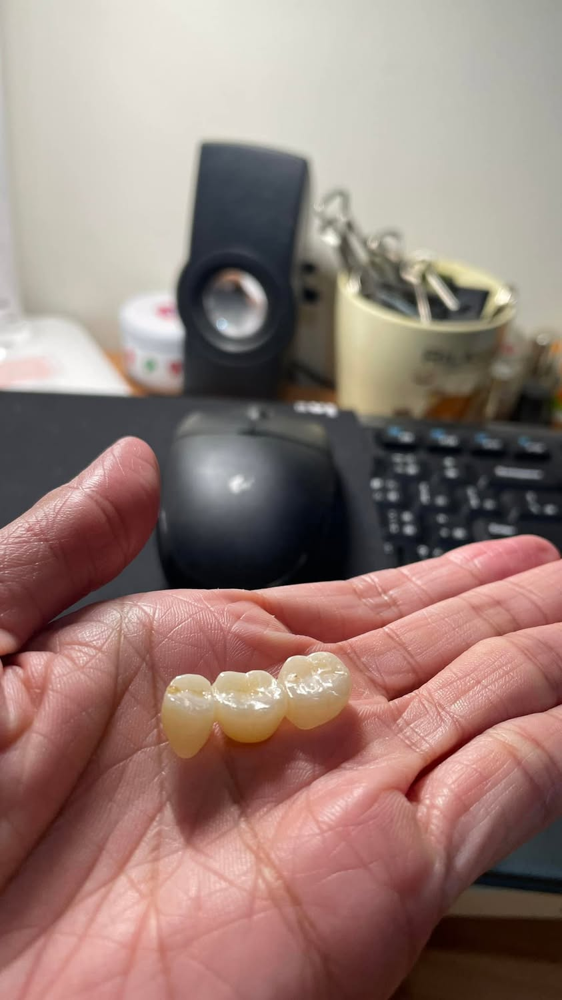

昨晚和史郎先生去看電影\
看電影前跑去買鹽酥雞\
想說吃完再進去電影院\
吃著吃著突然感覺我的口腔空空有一陣風\
然後咬到硬物

吐出來一看\
天啊！居然是我的牙橋\
然後凹洞裡滿滿的豬血糕跟雞肉\
我第一個反應覺得好好笑\
怎麼會發生這種事情啦

當時已經1930電影準備開演\
當下要立刻決定是否要放棄電影\
趕快找醫生\
還是看完再約醫生

也不知道為何\
昨天下午剛好在跟牙醫診所約重做維持器\
診所說醫生剛好這個星期六早上有加診\
問我可不可以約星期六早上\
由於星期六早上固定一對一重訓\
所以便約改天\
所以心中有譜\
星期六早上應該有機會可以看醫生\
便決定先來刷牙、洗牙橋\
進去電影院再跟診所用app約診\
今天也順利完成牙橋重黏這件事情

昨晚就在想\
還好不是在日本期間發生這件事情\
今年牙橋重做是因為有裂痕\
我怕去日本滑雪的時候\
如果遇到牙橋破裂\
那我的旅程就慘了\
結果居然會有牙橋脫落這種事情發生\
真是大開眼界\
哈哈哈

還好在台灣脫落\
還好隔天醫生剛好加診\
我真是個幸運的人耶\
今天看完醫生也可以來吃個肉桂捲

