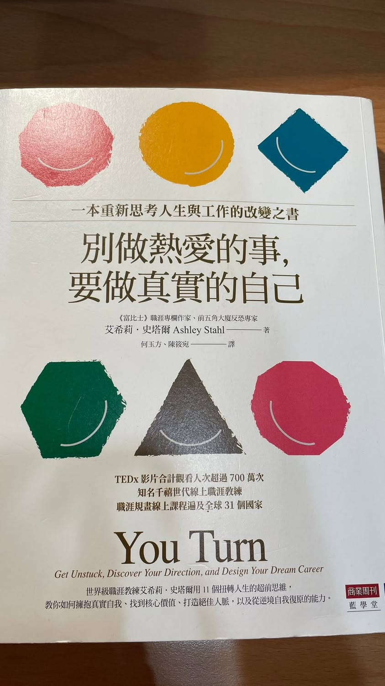

最近剛看完《別做熱愛的事，要做真實的自己》，看到裡面談「電梯簡報」這一章，突然覺得——

這好像不只是教我們怎麼自我介紹。

而是在教我們：

如果今天只有幾分鐘，你會怎麼介紹自己？

書裡提到，一個好的電梯簡報，可以用四個步驟來完成：

１、個人故事：吸引你的聽眾

先說一個跟自己有關的故事。

不是急著告訴別人「我很厲害」，而是讓對方知道，為什麼你會走到今天。

例如你的開場白可以是：

「我從小生長在……」

從一個故事開始，讓別人慢慢認識你。

２、即興吹噓：可以謙虛地自誇一下，或澄清他人的疑慮

以感恩之心，適度地說出自己的優勢。

這裡的「吹噓」不是炫耀，

而是不要謙虛到讓別人完全不知道，你到底有什麼值得被看見的地方。

３、技能：了解招聘人員希望應徵者具備的技能

你真正擅長什麼？

而且不是自己覺得自己很厲害就算了，

而是找出那些曾經被別人肯定過、你做起來也比一般人自然的能力。

所以在提出自己的優點時，最好以第三人的推薦方式呈現。

比方說：

「我的老闆總是告訴我，我有……的天賦，這對於解決團隊目前所遭遇的問題很有幫助。」

４、目標：點名希望得到理想的工作，或是拓展的人脈

最後，你必須讓對方清楚知道：

你的目標是什麼？

也就是——

所以，你現在想要的是什麼？

我看到這裡的時候，突然覺得，

這四個步驟其實很像是在重新認識自己。

以前我們很習慣介紹自己：

「我是做什麼工作的。」

「我在哪裡上班。」

「我做過哪些事情。」

但這些其實都比較像是「履歷」。

真正的自己，好像應該是：

我經歷過什麼 → 我因此成為什麼樣的人 → 我擅長什麼 → 我接下來想往哪裡走。

而且我發現，

最難的可能不是「故事」，

也不是「目標」。

反而是——

你敢不敢承認，自己其實有一些很厲害的地方？

我們從小被教導要謙虛。

所以常常別人稱讚我們的時候，第一個反應都是：

「還好啦。」

「沒有啦，剛好而已。」

「大家都可以啊。」

講久了，

連自己都快忘記：

原來這些事情，真的就是我的能力。

所以我很喜歡書裡「即興吹噓」這個概念。

不是叫你變得自戀，

而是提醒你：

不要因為害怕別人覺得你太驕傲，就把自己的優點全部藏起來。

我最近也越來越覺得，

人生走到某個階段之後，

我們需要的可能不是一直努力證明「我可以」。

而是開始慢慢整理：

我是誰？

我曾經走過什麼路？

那些經歷留下了什麼？

我真正擅長的是什麼？

我又想把這些能力帶到哪裡？

也許這就是「電梯簡報」真正有意思的地方。

它表面上是在教你如何介紹自己，

但更深一層，

其實是在逼你回答：

如果今天真的只剩下幾分鐘，要讓一個陌生人認識真正的你，你會怎麼說？

所以我覺得，

每個人有時間的時候，都應該好好想一套屬於自己的「電梯簡報」。

因為這是一份獨一無二的準備。

你不一定馬上用得到，

但你永遠不知道，

什麼時候會遇到那個值得你介紹自己的人，

也不知道什麼時候，一個機會就這樣突然出現在你面前。

我想，我也該開始練習了。

不是為了面試，

也不只是為了工作。

而是為了有一天，當機會真的來到面前時，

我可以很清楚地告訴對方：

「這就是我，而這是我想去的地方。」

